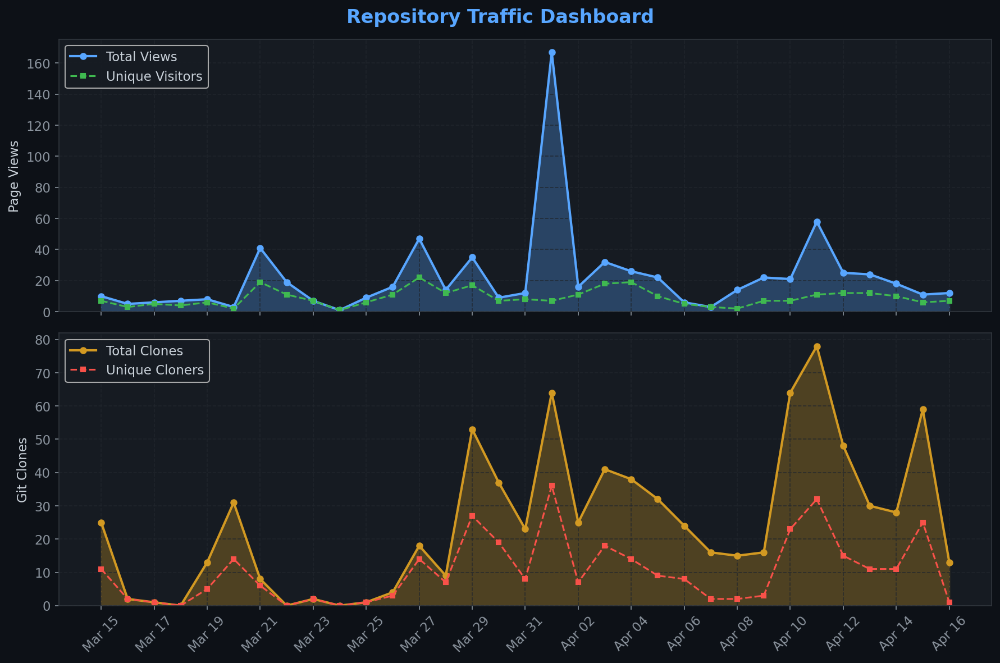
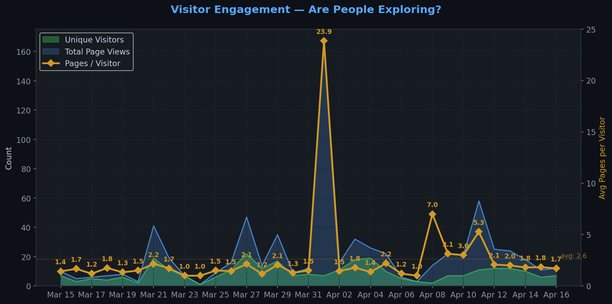
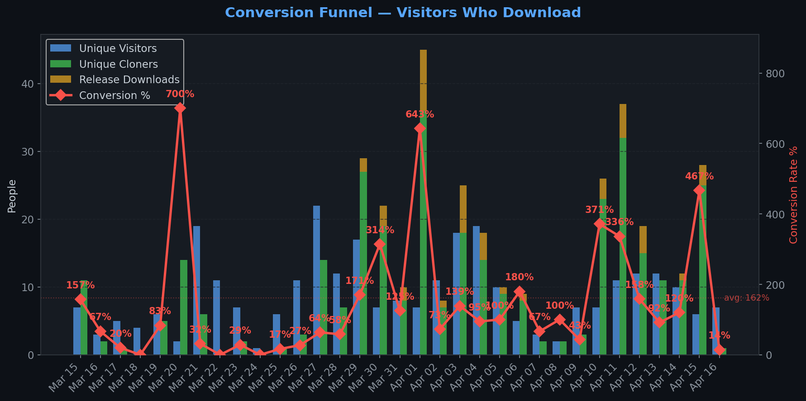
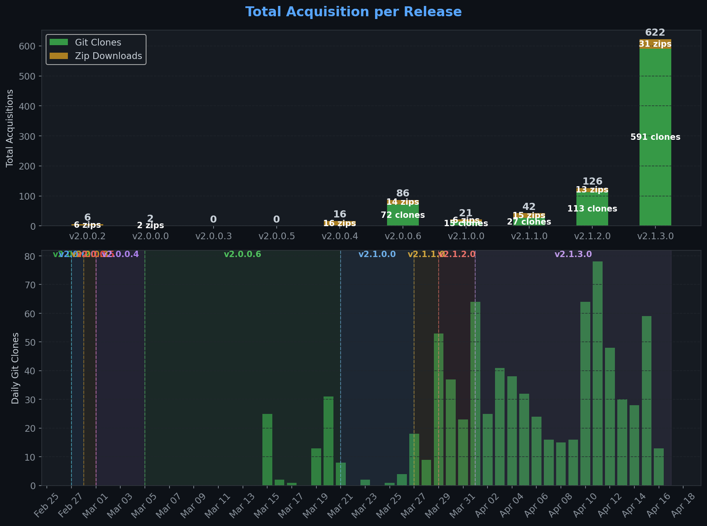
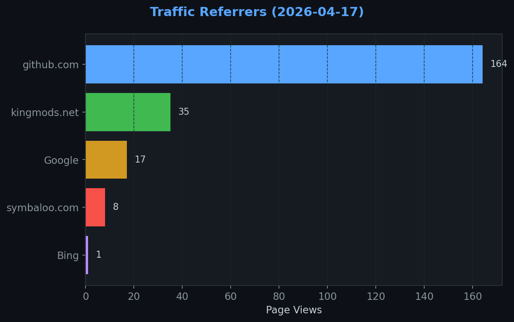
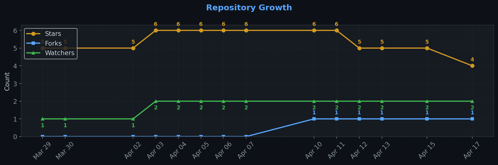

# Repository Traffic Dashboard

**Last updated:** 2026-04-17T19:00:10Z
**Days tracked:** 14 | **Download snapshots:** 57 (hourly)

---

## Views & Clones (14-day window, preserved forever)

| Metric | 14-Day Total | Unique |
|--------|-------------|--------|
| Page Views | 294 | 95 |
| Git Clones | 502 | 151 |

> **Engagement:** 3.0 pages per visitor (14-day avg)

---

## Visitor Engagement

> Higher = visitors exploring more pages. 1.0 = bounce. 3.0+ = deeply engaged.

---

## Conversion Funnel

> **14-day conversion:** 254 of 95 visitors cloned or downloaded (**267.3%**)
>
> Unique cloners: 151 | Release downloads: 103

---

## Total Acquisition per Release (Downloads + Clones)

| Channel | Count |
|---------|-------|
| Zip Downloads | 103 |
| Git Clones (14-day) | 502 |
| **Total Acquisitions** | **605** |

---

## Referrers

| Source | Views | Unique |
|--------|-------|--------|
| github.com | 164 | 49 |
| kingmods.net | 35 | 20 |
| Google | 17 | 9 |
| symbaloo.com | 8 | 1 |
| Bing | 1 | 1 |

---

## Repository Growth

| Metric | Current |
|--------|---------|
| Stars | 4 |
| Forks | 1 |
| Watchers | 2 |

---

## Top Pages (14-day)

| Page | Views | Unique |
|------|-------|--------|
| `/TheCodingDad-TisonK/FS25_RandomWorldEvents` | 178 | 88 |
| `/TheCodingDad-TisonK/FS25_RandomWorldEvents/releases/tag/v2.1.3.0` | 37 | 26 |
| `/TheCodingDad-TisonK/FS25_RandomWorldEvents/issues` | 30 | 5 |
| `/TheCodingDad-TisonK/FS25_RandomWorldEvents/releases` | 13 | 10 |
| `/TheCodingDad-TisonK/FS25_RandomWorldEvents/issues/11` | 8 | 3 |
| `/TheCodingDad-TisonK/FS25_RandomWorldEvents/tags` | 5 | 1 |
| `/TheCodingDad-TisonK/FS25_RandomWorldEvents/issues/8` | 4 | 4 |
| `/TheCodingDad-TisonK/FS25_RandomWorldEvents/commits` | 4 | 1 |
| `/TheCodingDad-TisonK/FS25_RandomWorldEvents/blob/master/modDesc.xml` | 3 | 1 |
| `/TheCodingDad-TisonK/FS25_RandomWorldEvents/edit/master/modDesc.xml` | 3 | 1 |

---

## Data Files

| File | Description | Granularity |
|------|-------------|-------------|
| [daily.json](daily.json) | Views & clones per day (never expires) | Daily |
| [downloads.json](downloads.json) | Release download snapshots | Hourly |
| [referrers.json](referrers.json) | Referrer snapshots | Daily |
| [metadata.json](metadata.json) | Stars, forks, watchers | Daily |
| [stats.json](stats.json) | Combined legacy snapshots | 6-hourly |

---
*Hourly download tracking + full dashboard with engagement metrics every 6 hours*
*Auto-generated by [traffic-stats.yml](../../.github/workflows/traffic-stats.yml)*
